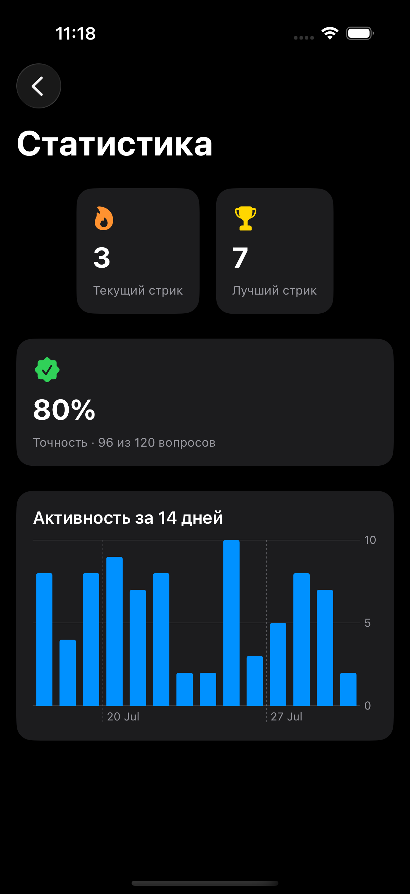

# 📚 NPCEnglish

Приложение для изучения английских слов на SwiftUI. Слова берутся из локального JSON — никакого бэкенда, никакого интернета, всё работает офлайн.

## ✨ Возможности

- 🎯 Квиз "выбери правильный перевод" из 4 вариантов
- ⌨️ Режим "Напиши перевод" — ввод ответа вручную, с допуском одной опечатки и частичным совпадением для многословных переводов
- 🔄 Два направления: английский → русский и русский → английский
- 📖 Наборы слов: 1000 слов уровня A1, 363 самых частых фразовых глагола, слова уровня A2 по 10 темам (работа, путешествия, здоровье, технологии, еда, деньги, характер, отношения, направления/город, медиа, образование, покупки)
- 🧠 Spaced repetition — квиз чаще показывает слова, на которых ты ошибался, и давно не повторявшиеся слова, с пометкой "Повторение"
- ⭐️ Избранное — сохраняй сложные слова из любого набора и повторяй их отдельно
- 🔥 Стрики — считаем дни подряд, в которые пройдена хотя бы одна сессия до конца
- 📊 Статистика — точность ответов и активность по дням, отдельный экран + мини-виджет на главном
- 📲 Виджет на домашний экран iOS — показывает текущий стрик, тап открывает квиз
- 🔊 Озвучка слов (офлайн, через системный TTS), выбор акцента (американский/британский)
- ⏰ Настраиваемые напоминания позаниматься, если стрик под угрозой
- 🎚 Настройки: длина сессии, направление перевода, тема (светлая/тёмная/системная), акцентный цвет, звук и вибрация
- 💛 Экран поддержки проекта — приложение полностью бесплатное, без каких-либо платных ограничений

## 📱 Скриншоты

<table>
  <tr>
    <td></td>
    <td></td>
    <td></td>
  </tr>
</table>

## 🛠 Технологии

- **SwiftUI** — весь UI
- **CoreData** — хранение избранного, прогресса обучения (spaced repetition), стриков и статистики. Модель данных задана программно, без `.xcdatamodeld`
- **WidgetKit** — виджет со стриком на главном экране, обновляется через `WidgetCenter`
- **AVFoundation** — офлайн-озвучка слов через `AVSpeechSynthesizer`
- **UserNotifications** — локальные напоминания позаниматься
- **Swift Charts** — график активности на экране статистики
- Архитектура: MVVM + протоколы для доменных сервисов (`FavoritesManaging`, `StatsManaging`, `WordProgressTracking`, `NotificationScheduling`, `SpeechSynthesizing`) — легко подменяются моками для превью и юнит-тестов

## 🚀 Как запустить

1. Клонируй репозиторий
2. Открой `NPCEnglish.xcodeproj` в Xcode
3. Убедись, что все `.json`-файлы из `Resources/` добавлены в Target Membership основного таргета
4. Настрой **App Group** в Signing & Capabilities для таргетов `NPCEnglish` и `NPCEnglishWidgetExtension` (нужно для доступа виджета к CoreData) — подробности в комментариях `CoreDataStack.swift`
5. Запусти на симуляторе или устройстве с iOS 17+

## 📋 Требования

- iOS 17.0+
- Xcode 16+ для сборки (проект тестируется в CI на Xcode 16.2; разработка велась на более новых версиях — деплоймент-таргет 17.0 остаётся совместимым)
- Swift 5.9+

## 🧪 Тесты и CI

Юнит-тесты покрывают:
- `QuizViewModel`, `TypingQuizViewModel` — логика квиза, сессии, избранное
- `CoreDataFavoritesManager`, `CoreDataStatsManager`, `CoreDataProgressManager` — работа с CoreData на in-memory сторе
- `AnswerChecker` — проверка ответов в режиме "Напиши перевод"
- `SpacedRepetitionSelector` — логика взвешенного выбора слов

GitHub Actions гоняет полный набор тестов на симуляторе iOS при пуше в `main`/`develop` и на каждый Pull Request.

