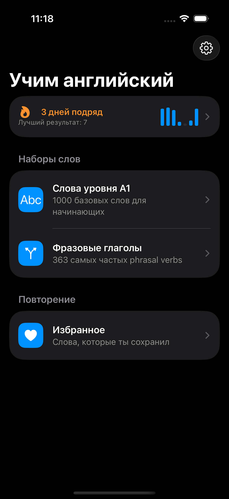
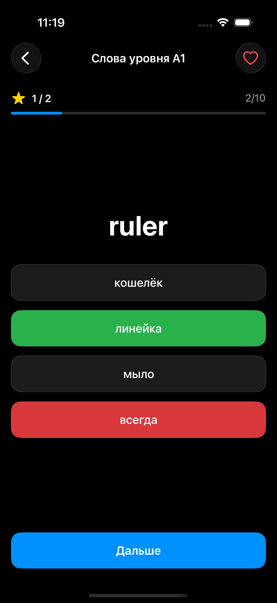

# 📚 NPCEnglish

Приложение для изучения английских слов на SwiftUI. Слова берутся из локального JSON — никакого бэкенда, никакого интернета, всё работает офлайн.

## ✨ Возможности

- 🎯 Квиз "выбери правильный перевод" из 4 вариантов
- 🔄 Два направления: английский → русский и русский → английский
- 📖 Два набора слов: 1000 слов уровня A1 и 363 самых частых фразовых глагола
- ⭐️ Избранное — сохраняй сложные слова и повторяй их отдельно
- 🔥 Стрики — считаем дни подряд, в которые пройдена хотя бы одна сессия
- 📊 Статистика — точность ответов и активность по дням
- 🎚 Настройки: длина сессии, направление перевода, тема (светлая/тёмная/системная), звук и вибрация

## 📱 Скриншоты

<table>
  <tr>
    <td></td>
    <td></td>
    <td></td>
  </tr>
  <tr>
    <td align="center">Главный экран</td>
    <td align="center">Квиз</td>
    <td align="center">Результат сессии</td>
  </tr>
  <tr>
    <td></td>
    <td></td>
    <td></td>
  </tr>
  <tr>
    <td align="center">Статистика</td>
    <td align="center">Настройки</td>
    <td></td>
  </tr>
</table>

## 🛠 Технологии

- **SwiftUI** — весь UI
- **CoreData** — хранение избранного, стриков и статистики (модель данных задана программно, без `.xcdatamodeld`)
- **Swift Charts** — график активности на экране статистики
- Архитектура: MVVM + протоколы для доменных сервисов (`FavoritesManaging`, `StatsManaging`) — легко подменяются моками для превью и тестов

## 🚀 Как запустить

1. Клонируй репозиторий
2. Открой `EnglishWords.xcodeproj` в Xcode 15+
3. Убедись, что `words_a1.json` и `phrasal_verbs.json` добавлены в Target Membership основного таргета
4. Запусти на симуляторе или устройстве с iOS 17+

## 📋 Требования

- iOS 17.0+
- Xcode 15+
- Swift 5.9+

## 🗺 Планы на будущее

- [ ] Spaced repetition (интервальные повторения)
- [ ] Озвучка слов через `AVSpeechSynthesizer`
- [ ] Наборы слов уровня A2/B1
- [ ] Достижения/бейджи
- [ ] iCloud-синхронизация избранного

